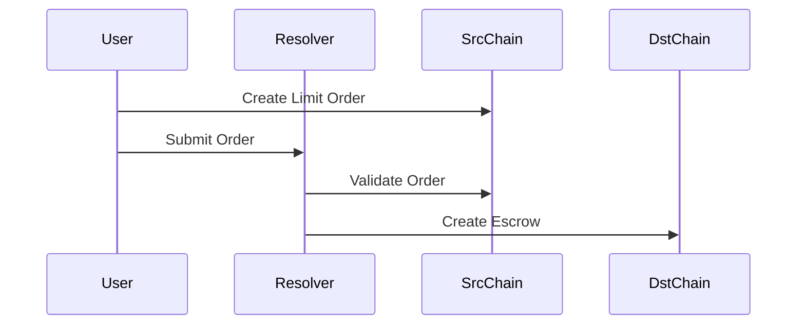

# Fusion Resolver - 1inch Fusion+ Cross-Chain Resolver

A professional resolver agent implementation for 1inch Fusion+ protocol, facilitating secure atomic cross-chain swaps through time-locked escrow mechanisms.

## 🌟 Overview

The Fusion Resolver acts as a trusted intermediary in the 1inch Fusion+ ecosystem, enabling users to perform cross-chain atomic swaps without the need for traditional bridges. The resolver handles order fulfillment, escrow management, and secret revelation in a trustless manner.

## 🛠️ Architecture

### Core Components

1. **FusionResolver**: Main resolver class handling cross-chain operations
2. **Blockchain Connectors**: Multi-chain provider management (Ethereum, Monad, TRON)
3. **Escrow Manager**: Time-locked contract interactions
4. **Order Processor**: 1inch Fusion+ order fulfillment logic
5. **API Server**: RESTful endpoint for client interactions

### Supported Networks

| Network | Chain ID | RPC Endpoint | Contract Support |
|---------|----------|--------------|------------------|
| Ethereum Sepolia | 11155111 | ethereum-sepolia-rpc.publicnode.com | ✓ |
| TRON Shasta | 2 | api.shasta.trongrid.io | ✓ |

## 🚀 Quick Start

### Prerequisites
* Node.js 16.x or higher
* Private keys for resolver operations
* Network access to supported blockchains

### Installation

1. **Clone and setup**
   ```bash
   git clone <repository-url>
   cd resolver
   npm install
   ```

2. **Environment Configuration**
   ```bash
   cp .env.example .env
   ```
   
   Configure your `.env` file:
   ```env
   # Resolver Private Keys
   RESOLVER_PRIVATE_KEY=0x...
   TRON_PRIVATE_KEY=...
   
   # Network Configuration (optional - defaults provided)
   ETHEREUM_RPC_URL=https://ethereum-sepolia-rpc.publicnode.com
   TRON_RPC_URL=https://api.shasta.trongrid.io
   
   # Server Configuration
   PORT=3001
   ```

3. **Start the resolver**
   ```bash
   npm run dev
   # or for production
   npm start
   ```

## 📁 Project Structure

```
src/
├── index.js               # Application entry point
├── server.js              # Express API server
├── fusion-resolver.js     # Main resolver implementation 
└── config.js              # Network and resolver configuration
```

## 🔗 API Endpoints

### Resolver Status
```http
GET /status
```
Returns resolver operational status and supported networks.

### Order Fulfillment
```http
POST /fulfill-order
Content-Type: application/json

{
  "orderHash": "0x...",
  "srcNetwork": "sepolia",
  "dstNetwork": "tron",
  "amount": "1000000",
  "makerAddress": "0x...",
  "takerAddress": "TR..."
}
```

### Order Status
```http
GET /order/:orderHash
```
Returns current status and details of a specific order.

### Escrow Management
```http
POST /create-escrow
POST /reveal-secret
POST /withdraw-escrow
POST /cancel-escrow
```

## 🔒 Security Model

### Time-Lock Phases

The resolver implements a sophisticated time-lock mechanism:

1. **Finality Lock** (5 minutes)
   - Wait for blockchain finality
   - Prevent reorganization attacks

2. **Private Withdrawal** (10 minutes)
   - Resolver can withdraw with secret
   - Exclusive resolver window

3. **Public Withdrawal** (20 minutes)
   - Anyone can complete with valid secret
   - Trustless fallback mechanism

4. **Cancellation Window** (30+ minutes)
   - Maker can reclaim funds
   - Safety mechanism for failed swaps

### Safety Deposits

* **Source Chain**: 1 ETH equivalent safety deposit
* **Destination Chain**: 1 ETH equivalent safety deposit
* Deposits ensure resolver commitment to order completion

## 🔄 Cross-Chain Flow

### 1. Order Creation


### 2. Order Fulfillment
```javascript
// Example order fulfillment
const order = {
  orderHash: '0x...',
  srcNetwork: 'sepolia',
  dstNetwork: 'tron',
  makingAmount: '1000000', // 1 USDC
  takingAmount: '990000',  // 0.99 USDC (with resolver fee)
  maker: '0x...',
  taker: 'TR...'
};

const result = await resolver.fulfillOrder(order);
```

### 3. Atomic Swap Completion
1. Resolver creates time-locked escrow on destination chain
2. Resolver fulfills order on source chain with secret hash
3. Resolver reveals secret to claim destination chain funds
4. User can claim source chain funds with revealed secret

## 📈 Monitoring & Analytics

### Order Metrics
* Total orders processed
* Success rate by network pair
* Average completion time
* Revenue from resolver fees

### Network Health
* RPC endpoint status
* Gas price monitoring
* Block confirmation times
* Contract interaction success rates

### Example Monitoring Dashboard
```javascript
// Access resolver metrics
const metrics = await resolver.getMetrics();
console.log({
  ordersProcessed: metrics.totalOrders,
  successRate: metrics.successRate,
  avgCompletionTime: metrics.avgTime,
  revenue: metrics.totalFees
});
```

## 🔧 Configuration

### Network Configuration
```javascript
// config.js - Network definitions
export const NETWORKS = {
  sepolia: {
    chainId: 11155111,
    rpcUrl: "https://ethereum-sepolia-rpc.publicnode.com",
    contracts: {
      settlement: "0x9B9B198e2E9e0E789A4B00190302754A6Faa6854",
      escrowFactory: "0xcBcFEe91Bbd4A12533Fc72a3D286B6d86ab2B9D5",
      usdc: "0x1c7D4B196Cb0C7B01d743Fbc6116a902379C7238"
    }
  },
  // Additional networks...
};
```

### Resolver Configuration
```javascript
export const RESOLVER_CONFIG = {
  address: "0xe841d59Bb054b5cf81cF8BEA1b74EcE5A12550F2",
  timeLocks: {
    srcFinalityLock: 300,        // 5 minutes
    srcPrivateWithdrawal: 600,   // 10 minutes
    srcPublicWithdrawal: 1200,   // 20 minutes
    // Additional timelock phases...
  },
  safetyDeposit: {
    src: "1000000000000000000", // 1 ETH
    dst: "1000000000000000000"  // 1 ETH
  }
};
```


## 🚑 Deployment

### Production Deployment

1. **Server Setup**
   ```bash
   # Clone and install
   git clone <repo>
   cd resolver
   npm install --production
   ```

2. **Environment Variables**
   ```bash
   export RESOLVER_PRIVATE_KEY="0x..."
   export TRON_PRIVATE_KEY="..."
   export NODE_ENV="production"
   export PORT=3001
   ```

3. **Process Management**
   ```bash
   # Using PM2
   npm install -g pm2
   pm2 start src/index.js --name "fusion-resolver"
   pm2 save
   pm2 startup
   ```

### Docker Deployment
```dockerfile
# Dockerfile
FROM node:18-alpine
WORKDIR /app
COPY package*.json ./
RUN npm install --production
COPY src/ ./src/
EXPOSE 3001
CMD ["npm", "start"]
```

```bash
# Build and run
docker build -t fusion-resolver .
docker run -d -p 3001:3001 --env-file .env fusion-resolver
```

### Debug Mode
```bash
# Enable detailed logging
DEBUG=fusion-resolver:* npm run dev
```

**Powered by 1inch Fusion+ Protocol**
